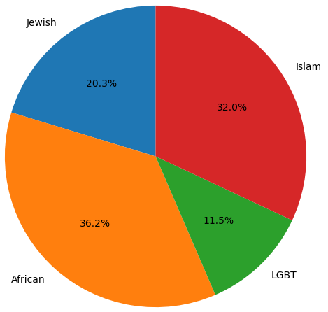

# Hate Speech Targets Detection in Parler using BERT
Online social networks have become a fundamental component of our everyday life. Unfortunately, these platforms are also a stage for hate speech. Popular social networks have regularized rules against hate speech. Consequently, social networks like Parler and Gab advocating and claiming to be free speech platforms have evolved. These platforms have become a district for hate speech against diverse targets. We present in our paper a pipeline for detecting hate speech and its targets and use it for creating Parler hate targets' distribution. The pipeline consists of two models; one for hate speech detection and the second for target classification, both based on BERT with Back-Translation and data pre-processing for improved results.

Full paper: https://arxiv.org/abs/2304.01179

## Hate Speech Targets distribution out of 824,848 Parler posts

